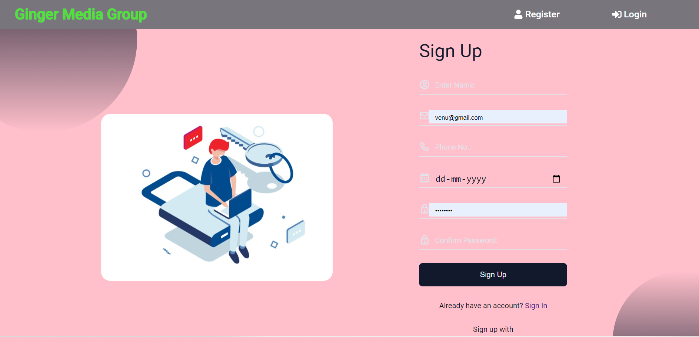
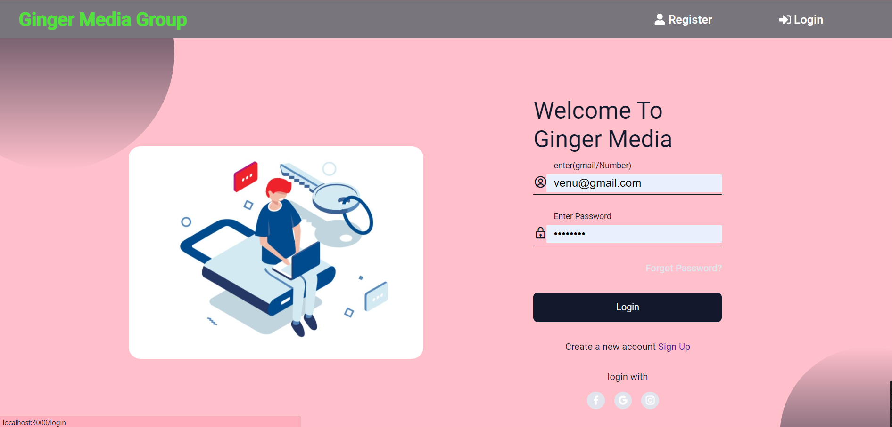
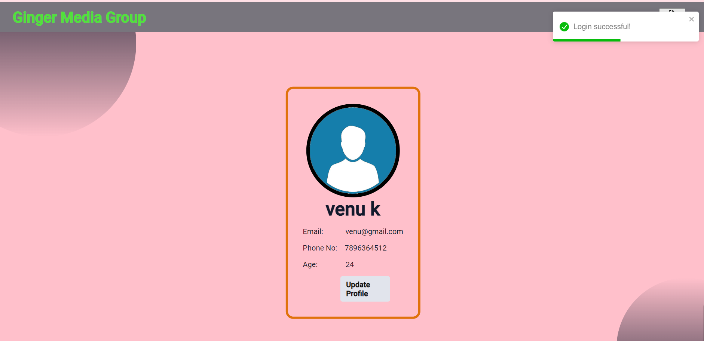
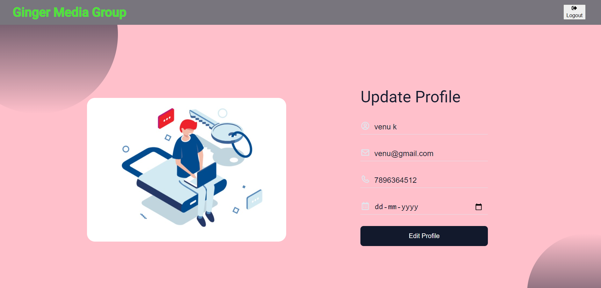

<h2 align='center'>Ginger Media Assignment 📃</h2>
<p align="center">
<a href="https://github.com/venukurugonda1"></a>
</p>

<p align="center">
<a href="https://github.com/venukurugonda1/"></a>
<a href="https://github.com/venukurugonda1/ginger-group/stargazers/"></a>
<a href="https://github.com/venukurugonda1/ginger-group/network/members"></a>
<a href="https://github.com/venukurugonda1/ginger-group/issues">
</a>

</p>

<p align="center">
    Ginger Media Assignment
</p>

## live-link 🔗

<a target="_blank" href="https://ginger-media-yz0x.onrender.com/"><b>https://ginger-media-yz0x.onrender.com/</b></a>

# main features

- register a user
- login a user
- logout a user
- show profile page
- update profile

# Demo Creadential

- email : - `venu@gmail.com`
- password: - `Test@123`

# tech stack used

Fronted

- html, css, js, React

Backend

- nodejs, express

Database

- MySql

## Installation

```sh

# Clone the repo
$ git clone git remote add origin git remote add origin https://github.com/venukurugonda1/ginger-group.git

# Install
$ npm install

# Setting Up ENV
> setup .env file for database


# Start
$ npm start

# Access your app
$ http://localhost:${PORT}

```

## Example

### register a user

<br/>
<div align="center">
  
</div>
<br/>
<br/>

### login a user

<div align="center">
  
</div>
<br/>

### main Dashboard

<div align="center">
  
</div>
<br/>

### update profile

<div align="center">
  
</div>
<br/>

## Author

👤 **Venu Kurugonda**

- Github: [@venukurugonda1](https://github.com/venukurugonda1)
- LinkedIN: [@venu kurugonda](https://www.linkedin.com/in/venukurugonda/)

---

## License

&copy; Venu Kurugonda | MIT
